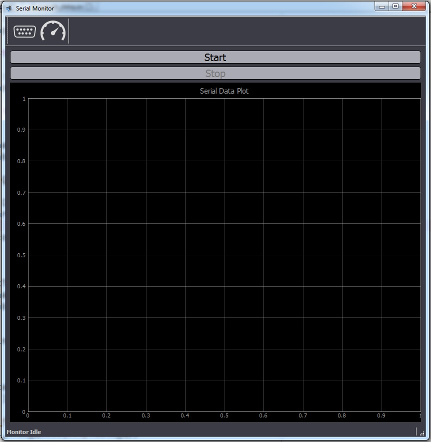

# Quadcopter Project
Hello!

I started this project in order to learn all the programming skills required to build an ATmega328P-controlled quadcopter. I am starting with the very basics in order to understand everything I make during the project. My main motivation is to find a specific subject related to the flight-controller design of which I can write my masters thesis on. So far I have a few ideas, but I need to invest more time to really find what would be the best subject to work on. I am really interested in different flight control algorithms, inertial measurment filtering methods and guidance and navigation in general.

As a first objective I decided to design the prototype flight controller based on Arduino Uno. With a working prototype flight controller I will design my own board with ATmega328P. For inertial measurements I am using the Invensense MPU6050 IMU.

The controller design was greatly inspired by Joop Brokking's <a href="http://www.brokking.net">Youtube channel</a> and <a href="https://www.youtube.com/user/MacPuffdog/featured">blog</a>. I find his YMFC-3D quadcopter video tutorials of great help and will refer to them often during the project. The design is also based on the YMFC-3D. I have just received most of the components for the quadcopter and will post the parts list with images as soon as I assemble it.

I used many libraries from other Github users. All references to the authors are under each subsection of the readme file where the library is used.

My starting point was the development of the serial graphing monitor. This is a necessary tool for signal analysis during the development. First I wrote graphing monitor with Python 2.7 and later with C#. Both serial graphing programs are described below.

<h2>Serial Graphing Monitor</h2>

Moved to 2 separate repositories, one for the program in Python and another for the program in C#!

<b>1. Serial Graphing Monitor - Python 2.7</b> is used to visualize the data sent via serial communication. I use it to analyze the data sent from the MPU6050 IMU connected to Arduino. Current code is written for Python 2.7. If you want to run it on Python 3 you need to change a couple of things (For example: -Py 2: from Queue import Queue -Py 3: from queue import queue).

In order to run the code you need to install the following libraries:
<ul>
  <li>PyQtGraph</li>
  <li>PyQt 4.8+ or PySide</li>
  <li>NumPy</li>
  <li>PySerial</li>
</ul>

Place the following files in a folder:

<ul>
  <li>DataMonitor.py</li>
  <li>globals.py</li>
  <li>ComMonitor.py</li>
  <li>SP_logo.png</li>
  <li>COMPORT.png</li>
  <li>BAUDRATE.png</li>
</ul>

To start the program run DataMonitor.py.

The program is written to receive maximum three separate values at a time from serial. For now it is programmed so all three values need to be packed in a single line, for example, if you want to plot readings from all X, Y, and Z accelerometer axis you should write them to serial like this "AccX AccY AccZ\n". If only one or two values are written to serial, then only one or two data sets will be plotted.

Code was inspired by <a href="https://github.com/mba7/SerialPort-RealTime-Data-Plotter"> MBA7's SerialPort-RealTime-Data-Plotter </a> and
<a href="http://eli.thegreenplace.net/2009/08/07/a-live-data-monitor-with-python-pyqt-and-pyserial/"> Eli Bendersky work</a>.

<b>2. Serial Graphing Monitor - C# Windows Forms</b> was written after I developed the graphing program in Python. I found a desire to improve my knowledge of C# so I used this opportunity  to write a program I needed.

In order to run the program you need to install <a href="http://zedgraph.sourceforge.net/samples.html">ZedGraph</a>.

<h2>Libraries for ATmega328 and Arduino</h2>
<b>1. AK_MPU6050_lib for ATmega328: </b>

I am working on a library to use MPU6050 IMU with ATmega328P chip. As of September 19, 2016 the library contains the following functions:

<ul>
  <li>MPU6050_init()</li>
  <li>MPU6050_test_I2C()</li>
  <li>MPU6050_get_accel()</li>
  <li>MPU6050_get_gyro()</li>
  <li>MPU6050_set_sleepMode()</li>
  <li>MPU6050_set_gyroFS()</li>
  <li>MPU6050_set_accelFS()</li>
  <li>MPU6050_set_clockSource()</li>
</ul>

The AK_MPU6050_lib uses <a href="https://github.com/g4lvanix/I2C-master-lib">I2c-master-lib by g4lvanix</a> for I2C communication with the MPU6050 chip.

<b>2. USART library for ATmega328: </b>

This is a slightly modified version of a USART library written by Elliot Williams for his <a href="http://www.littlehacks.org/avr-programming">AVR Programming book</a>. I must note that I have learned most of my AVR programming knowledge from this book and I highly recommend it.

<h2>Quadcopter Components</h2>

I have finally received all the components for the quad. I bought almost everything from <a href="http://www.brokking.net/ymfc-al_main.html">Brokking's list</a> for his YMFC-3D AL quadcopter. Links to each part at dx.com are on his website. The only thing I bought in my local RC store was the LiPo charger and the batttery, since LiPo batteries could not be shipped to EU from dx.net.

First problem I ran into was that I had no idea on how to work with LiPo batteries, since they be quite dangerous if not handled properly. <a href="http://www.tjinguytech.com/charging-how-tos">This link</a> taught me all I needed for now.

I have also bought all the miscallaneous components, such as heat-shrink tubes, various cables, etc. I will be posting the complete parts list soon.

Author: alex.kraljic@gmail.com

There is still a lot to fix, add, and improve, so any suggestions and corrections are welcome!
